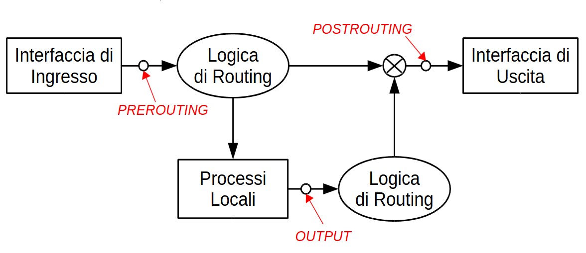

# laboratorio di reti 
## livello network
- `ctrl+m ` nuova macchina
- `ctrl+s` nuovo switch
- `ctrl+d` nuovo cavo dritto
    - per far comunicare dispositivi di __diverso__ livello
- `ctrl+c` nuovo cavo incrociato
    - per dispositivi dello __stesso__ livello

### configurazione di rete
`/etc/network/interfaces` oppure se si vuole usare + file indipendenti `/etc/network/interfaces.d/*`

`nmcli` sovrascrive le regole di `/etc/network/interfaces`

direttive interfaccia di rete

- `iface ethN inet static`
    - attiva un interfaccia definita in modo statico 
- `address `
- `netmask`
- `broadcast`
- `gateway`

esempio

``` bash

auto eth0
iface eth0 inet static
    address 192.168.1.1
```

__attenzione__ auto fa attivare al avvio dei sistemi le interfacce di rete

`ifdown eth0 && ifup eth0` per disattivare e ri attivare un interfaccia di rete `-a` le attiva tutte

### consultare la configurazione

- `ifconfig [-a] [name]`  __attenzione__ se l'interfaccia __non__ è attiva non verrà visualizata dal comando ma verrà visualizata con `-a`

+ `ip addr show dev [name]`

## verifica della configurazione

+ connessioni livello 2:
    - arping 
    - `arping -i eth0 192.168.1.254`
    - devono essere stesso dominio __broadcast__
+ connessioni livello 3
    +  ping

```bash 
ifdown eth0
editor /etc/network/interfaces  # modificatelo a piacimento
ifup eth0
```
`service networking restart`  per un restart


per testare se una configurazione è ottimale meglio usare configurazione temporanea

`ip addr {add, change, replace} dev <interfaccia>  <ip>` oppure 
`ifconfig <iface> <ip-address> [up]`

per attivare le interfaccie di rete sneza che vadano nei file di configurazione, due comandi:
- `ip link set dev <iface> {up,down}`
- `ifconfig <iface> {up,down}` 

rimuovere interfaccia di rete

- `ip addr del <address> dev <iface>`
- `ifconfig <iface> 0`

## livello ip 
## ip forwarding 
possibilità di accettare pacchetti e mandarli verso altre reti.
per abilitarla usare il comando temporaneo `sysctl -w net.ipv4.ip_forward=1`
per farlo in modo definitivo
`sysctl -p /etc/sysctl.conf` dopo aver messo il parametro `=1` nel file.


per veserele tabelle di routing `route -n` oppune `/sbin/route` o `ip route show`

3 diversi tipi di routing da aggiungere 
 
 1) routing tramite singolo host
    -  `route add <HOST> gw <gateway>`
    - se voglio xontattare `host` devo contattare `gateway`
2) routing per sottorete
    - `route add -net <net> netmask <netmask> gw <GW>`
    - per parlare con la rete `net` inoltrare alla macchina `gw`
3) default gateway
    + `route add default gw 192.168.1.254`
    + se nessuna delle regole precedenti funziona mandare al gatway

    simulare internet 

    `ifconfig eth0 1.1.1.1/32`

    `route add -host 2.2.2.2 dev eth0`
### alias di rete e indirizzi multipli
`ip addr add dev eth0 192.168.0.1/24`
su interfaces va specificato con il  "__:__"
```bash
auto eth0:0
iface eth0:0 inet static
    address 192.168.0.1
    netmask 255.255.255.0
```
## VLAN

* access link (non sanno di far parte di una Vlan)

* Trunk link connette dispositivi che sanno di essere in una VLAN

### vlan trunk 
sul dispositivo si setta 
`ip link add link <eth fisica> <virtual interface> type vlan id <N vlan>`

su linux per rendere la configurazione permanente
```
auto <physif>.<N>
iface <physif>.<N> inet static
address <ip_address>
netmask <netmask>
gateway <ip_addr_gateway>
```

comandi su switch 
* `port`
* `vlan`&rarr; gestione vlan 
* `hash` &rarr; gestione hash table 

### vlan 
`vlan/create vlan_n` crea la vlan di valore vlan_n

`port/setvlan port_n vlan_n` &rarr; untagged quindi access link quindi accetta pacchetti non taggati

`vlan/addport vlan_n port_n` &rarr; tagged quindi trunk link 

### configuazione host
configurazione temporanea:
``` bash
ip link add link eth0 vlan30 type vlan id 30
ip address add 192.168.3.1/24 dev vlan30
ip link set dev vlan30 up
```
configurazione permanente:

```bash
auto eth0.30
iface eth0.30 inet static
    address 192.168.3.1
    netmask 255.255.255.0
```

## Iptables 

3 tabelle:

1) NAT 
2) mangle
3) filter

### Tabelle di NATTING

3 __catene__:

* __output &rarr;__ Dnatting per traffico generato localmentte 
* __prerouting &rarr;__ Dnatting Traffico generato esternamente
* __postrouting &rarr;__ SNatting su tutti i pacchetti



per visualizzare le regole
`iptables -t nat -L -v -n`

rimuovere una specifica regola
`iptables -t nat -D <chain> <rule_number>`

### postrouting 

`iptables -t nat -A POSTROUTING -o <output_iface> -j <action>`


`<action>` può essere:
1) `MASQUERADE`:
    - trasforma il __source ip__ con l'ip del interfaccia uscente

2) `SNAT --to-source <IP>`:
    - modifica l'ip uscente con l'ip specificato

mentre per creare una specifica corrispondenza tra local ip e out ip bisogna usare il comando `-s`
`iptables -t nat -A POSTROUTING
-o <output_iface> -s <local_ip> -j <action>`

## prerouting

```bash
iptables -t nat -A PREROUTING \
-j DNAT -i <iface> \
 -d <public_ip> --to-destination <private_ip>
 ```
i pacchetti in entrata in `<iface>` per public ip vengono modificati in private

se volessimo specificare protocolli specifici dobbiamo usare il comando 

```bash 
iptables -t nat -A PREROUTING -j DNAT \
-i <iface> -d <public_ip> \
-p <protocol> --dport <port> \
--to-destination <private_ip:port>
```
## salvataggio 
`iptables-save > /etc/iptables/rules.v4` 

`iptables-restore < /etc/iptables/rules.v4`

## Firewall

2 policy 

1) `iptables -P INPUT ACCEPT`
    - accetta tutto ciò che non è negato
2) `iptables -P INPUT DROP` rifiuta tutto cio che non è specificatamente accettato 

```bash 
iptables -A <chain>
-i <input-interface>
-o <output-interface>
-s <source-ip/network>
-d <destination-ip/network>
-p {udp,tcp} --dport <destination-port> --sport <source-port>
-m state --state <states>
```
### esempi su un host
Accettare il nuovo traffico HTTP in ingresso
```
iptables -A INPUT -p tcp --dport 80 \
-m state --state NEW,ESTABLISHED -j ACCEPT
```
Accettare il traffico HTTP in uscita solo se è relativo a richieste già
accettate in ingresso
```
iptables -A OUTPUT -p tcp --sport 80 \
-m state --state ESTABLISHED -j ACCEPT
```
### esempi su un router
```
iptables -A FORWARD -p tcp --dport 80 \
-i eth0 -o eth1 \
-d <ip-address> \
-m state --state NEW,ESTABLISHED -j ACCEPT
```
Accettare il traffico HTTP in uscita solo se è relativo a richieste già
accettate in ingresso
```
iptables -A FORWARD -p tcp --sport 80 \
-i eth1 -o eth0 \
-s <ip-address> \
-m state --state ESTABLISHED -j ACCEPT
```

### altre opzioni specifiche 

`-p icmp --icmp-type {echo-request,echo-reply}`
specifica la tipologia di icmp 

o possiamo specificare il codice
`-p icmp --icmp-type <icmp-code>`

## DHCP
### Lato client
run time configuration `dhclient -i <iface>` e per farlo runnare `dhclient -r`

invece se si volesse fare staticamnte `inet dhcp` invece di `inet static`

`/etc/init.d/isc-dhcp-server start`

configurazioni possibili

`etc/dhcp/dhclient.conf`:
* __retry__: Tempo che intercorre tra una ricerca e la successiva se
il server non è stato trovato
* __reboot__: tenta di riottenere lo stesso IP che ha ottenuto in
precedenza.
* __request__: options che il client vuole ricevere durante
un'offerta.
* __require__: opzioni che il cliente vuole necessariamente
accettare da un'offerta.
* __send__: opzioni da spedire al server
esempio di configurazione su `etc/dhcp/dhclient.conf`:
```bash 
send dhcp-lease-time 3600;
request subnet-mask, broadcast-address, time-
offset, routers,domain-name, domain-name-
servers, domain-search, host-name,;
require subnet-mask, domain-name-
servers,host-name;
timeout 60;
retry 60;
```
### Lato server
`etc/dhcp/dhclient.conf`
e poi `/etc/init.d/isc-dhcp-server start`

esempio:
```
# Setup della sottorete:
subnet 192.168.0.0 netmask 255.255.255.0 {
range 192.168.0.100 192.168.0.253;
option subnet-mask 255.255.255.0;
option routers 192.168.0.254;
}
# Binding manuale tramite MAC address
host mynotebook {
hardware ethernet AA:AA:AA:AA:AA:AA;
fixed-address 192.168.0.10;
}
```
 tutti i parametri:
* __option subnet-mask__: netmask del default gateway
* __option broadcast-address__
* __option routers :__ IP del default gateway
* __option domain-name__: definizione del nome del domain
* __option domain-name__-servers: definizione del server DNS
* __option static-routes__: definizione di route statiche (NON CIDR)
* __option smtp-server__: definizione dei mail-server
* __option ntp-servers__:, definizione dei time server
* __option netbios-name__-servers: definizione dei WINS-Server
* __default-lease-time__: validità standard di un indirizzo IP
* __max-lease-time__:, tempo massimo di validità di un indirizzo IP
assegnato.

per le regole di routing dinamico bisogna inserire
`option rfc3442-classless-static-routes code 121 = array of unsigned integer 8;`
e poi :
`option rfc3442-classless-static-routes <nbits>, <netid>, <gateway>;`
dove 
- `nbits` notazione in bit della netmask;
- `netid` ottetti significativi del netid target separati da virgola;
- `gateway` indirizzo IP del gateway

esempio: `option rfc3442-classless-static-routes 24, 192,168,1, 192,168,0,254;`
default gateway`option rfc3442-classless-static-routes 0, <gateway>`

possiamo inserire più regole di routing in una riga
`option rfc3442-classless-static-routes 0, 192,168,1,254, 24, 192,168,0, 192,168,1,253;`

### dhcp relay 
per quando il server dhcp sta su una lan differente (c'è un router di mezzo)
